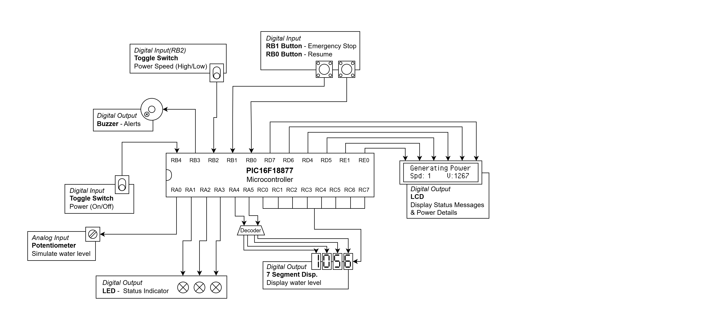
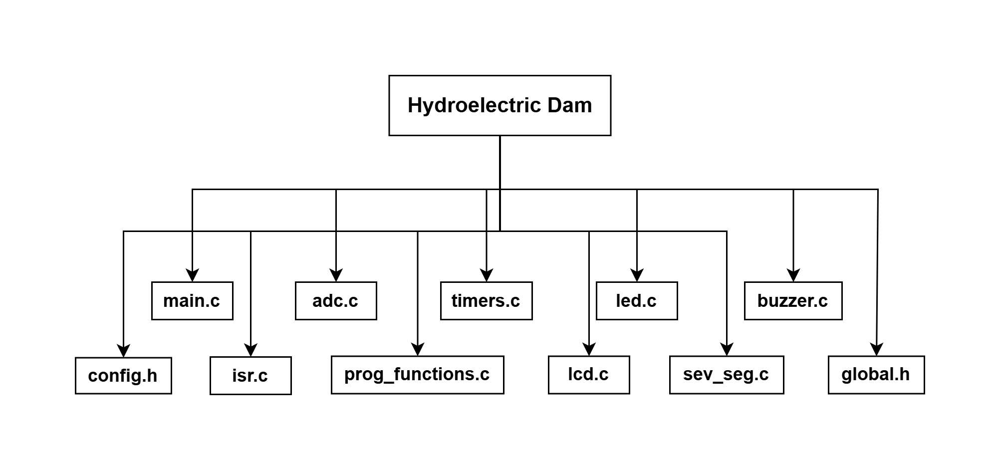
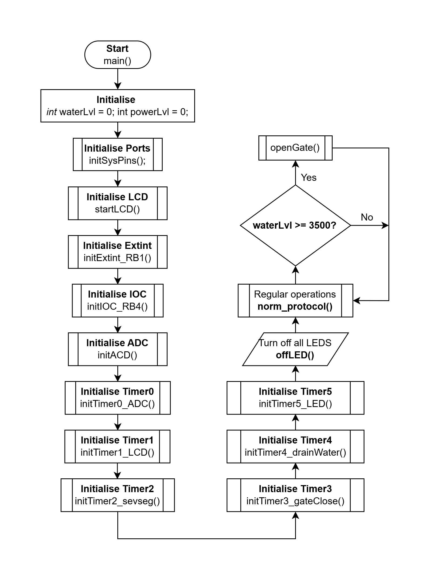
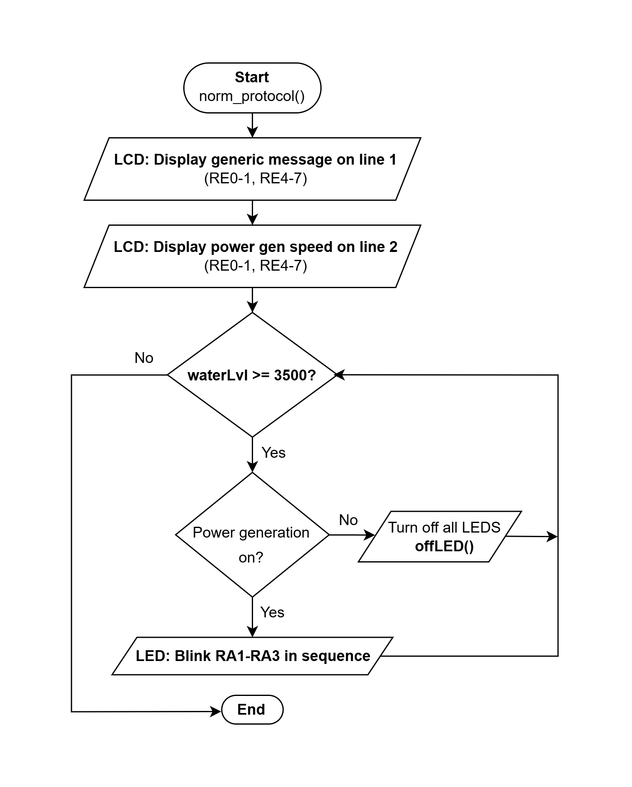
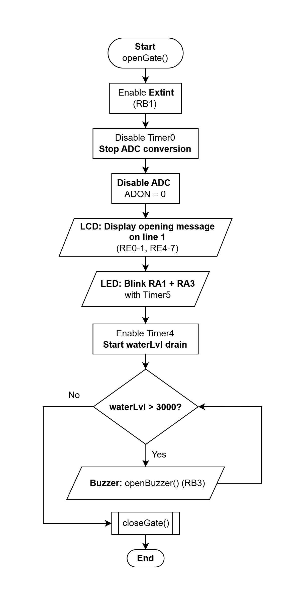
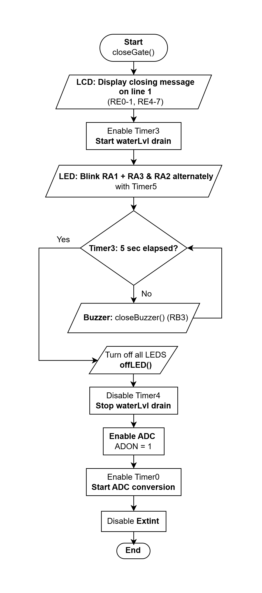
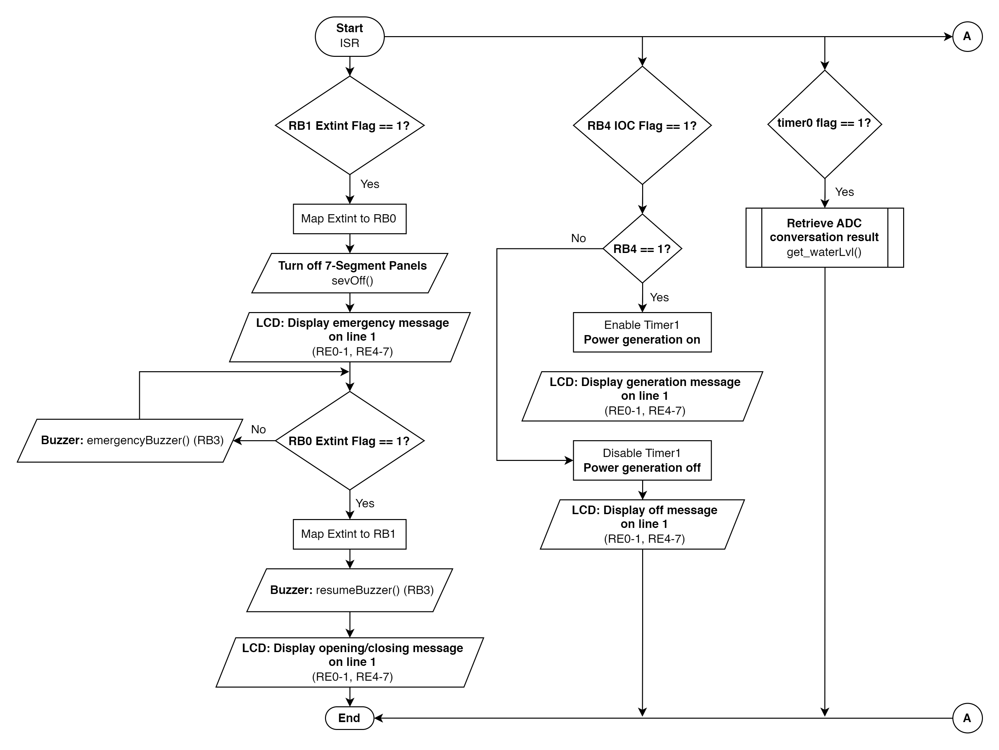
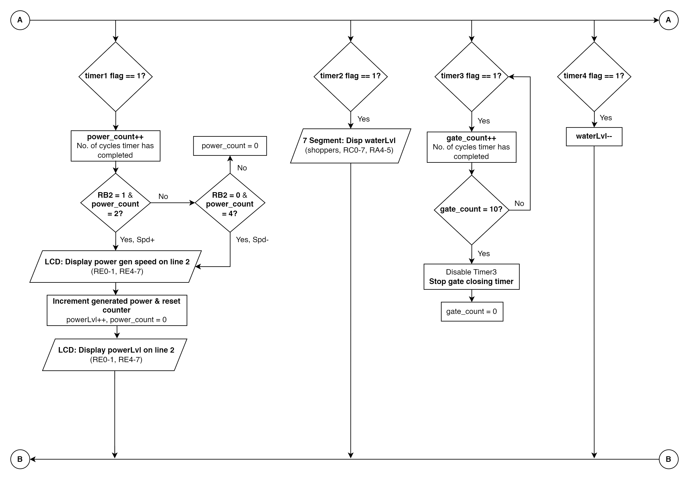
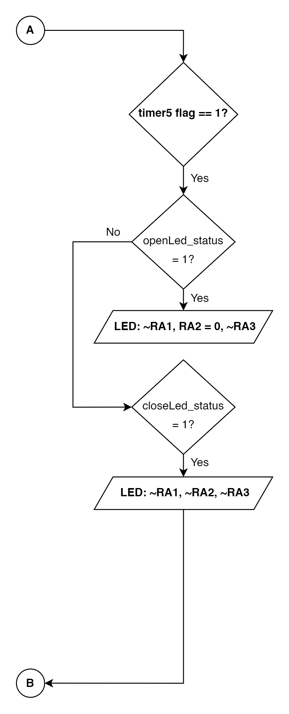

# Hydroelectric Damn

## Project Objective
The objective of this project is to design & create a machine that will handle the main operations of the hydroelectric dam. The system should be able to concurrently monitor the water levels in the dam as well as produce a steady stream of electricity for use by the town nearby. Once the water level in the dam has passed a certain threshold, the program should automatically initiate a sequence to open the dam’s gates and allow the release of water. Once the water level has come down to or below a minimum allowable level, the system should then proceed to close the gates. While opening & closing, the program will also emit warningsin the form of light and sounds to alert those near by to stay clear. In case of any emergency, this system should allow the operator to pause & resume the opening/closing gate sequences at any time. While the program is on hold, the machine will indicate its paused status through light & sounds. Our team has also decided to include a feature where the operator can choose to vary the speed of the power generation. 

## Port Listing

| Pin | ANSELx | TRISx | Device Name: PIN Name | Remarks |
|-----|---------|--------|------------------------|----------|
| RA0 | Analog | Input | Potentiometer | - |
| RA1 | Digital | Output | LED | LED3 |
| RA2 | Digital | Output | LED | LED2 |
| RA3 | Digital | Output | LED | LED1 |
| RA4 | Digital | Output | 7-Segment 2 to 4 Decoder | - |
| RA5 | Digital | Output | 7-Segment 2 to 4 Decoder | - |
| RA6 | Digital | Input | Already used by oscillator | - |
| RA7 | Digital | Input | Already used by oscillator | - |

**ANSELA = 0b00000001;**
**TRISA = 0b11000001;**

| Pin | ANSELx | TRISx | Device Name: PIN Name | Remarks |
|-----|---------|--------|------------------------|----------|
| RB0 | Digital | Input | Push Button | Resume |
| RB1 | Digital | Input | Push Button | Emergency Stop |
| RB2 | Digital | Input | Toggle Switch | Power gen speed |
| RB3 | Digital | Output | Buzzer | - |
| RB4 | Digital | Input | Toggle Switch | Power toggle |
| RB5 | Unused (Digital) | Unused (Input) | - | - |
| RB6 | Digital | Input | Already used by PICkit-4 | Set as input |
| RB7 | Digital | Input | Already used by PICkit-4 | Set as input |

**ANSELB = 0;**
**TRISB= 0b11110111;**

| Pin | ANSELx | TRISx | Device Name: PIN Name | Remarks |
|-----|---------|--------|------------------------|----------|
| RC0 | Digital | Output | 7-Segment | - |
| RC1 | Digital | Output | 7-Segment | - |
| RC2 | Digital | Output | 7-Segment | - |
| RC3 | Digital | Output | 7-Segment | - |
| RC4 | Digital | Output | 7-Segment | - |
| RC5 | Digital | Output | 7-Segment | - |
| RC6 | Digital | Output | 7-Segment | - |
| RC7 | Digital | Output | 7-Segment | - |

**ANSELC = 0;**
**TRISC = 0;**

| Pin | ANSELx | TRISx | Device Name: PIN Name | Remarks |
|-----|---------|--------|------------------------|----------|
| RD0 | Unused (Digital) | Unused (Input) | - | - |
| RD1 | Unused (Digital) | Unused (Input) | - | - |
| RD2 | Unused (Digital) | Unused (Input) | - | - |
| RD3 | Unused (Digital) | Unused (Input) | - | - |
| RD4 | Digital | Output | LCD | - |
| RD5 | Digital | Output | LCD | - |
| RD6 | Digital | Output | LCD | - |
| RD7 | Digital | Output | LCD | - |

**ANSELD = 0;**
**TRISD= 0b00001111;**

| Pin | ANSELx | TRISx | Device Name: PIN Name | Remarks |
|-----|---------|--------|------------------------|----------|
| RE0 | Digital | Output | LCD Enable | - |
| RE1 | Digital | Output | LCD Register Select | - |
| RE2 | Unused (Digital) | Unused (Input) | - | - |
| RE3 | Digital | Input | Already used as Reset Pin (MCLR) | - |
| RE4 | Unused (Digital) | Unused (Input) | Pin not present | Set as unused |
| RE5 | Unused (Digital) | Unused (Input) | Pin not present | Set as unused |
| RE6 | Unused (Digital) | Unused (Input) | Pin not present | Set as unused |
| RE7 | Unused (Digital) | Unused (Input) | Pin not present | Set as unused |

**ANSELE = 0;**
**TRISE= 0b11111100;**

## Block Diagram

## Pictures of Board

Figure 1 - Regular operation, power production is on, and speed is high

Figure 2 - Gate opening operation  
  
Note: We were not able to capture the numbers on the 7-segment panels.

## Program Design Map

1. global.h - Store the main global variables, waterLvl, powerLvl & segTable. Store all function declarations.  
   
2. main.c - Integrates functions from other source files into the main program flow.  
**Functions**  
• **initSysPins()** - Configures ports

3. prog_functions.c - Integrates functions that control the outputs (LED, LCD, 7-segment & buzzer) into situational functions. Eg. When the gate opens, a set of outputs are triggered along with other processes.  
**Functions**  
• **norm_protocol()** - Triggers required outputs like LED, LCD, 7-segment & buzzer for regular operation while using timed interrupts to ensure everything runs concurrently.  
• **openGate()** - Triggers required outputs like LED, LCD, 7-segment & buzzer to simulate the opening of the dam gates & water drainage, while using timed interrupts to ensure everything runs concurrently. The function will disable the ADC stop collection from data and interferring with the water release and enable Timer4 to decrement the waterLvl. External interrupt will be enabled to allow the emergency stop button (RB1) to work during the gate opening. Once the water level has decreased to a safe level, closeGate() will commence.  
• **closeGate()** - Triggers required outputs like LED, LCD, 7-segment & buzzer to simulate the closing of the dam gates, while using timed interrupts to ensure everything runs concurrently. The functin will enable Timer3 to simulate that the gate takes 5 seconds to close. After this time, the function will disable Timer4 to stop decrementing waterLvl, enable Timer1 & ADC, and disable the external interrupt that is used for the emergency stop.
• **emergencyStop()** - Triggers required outputs like LED, LCD & buzzer to simulate an emergency protocol, while using timed interrupts to ensure everything runs concurrently. The 7-segment will continue to display the water levels. The function will conduct polling to check if the resume button (RB1) has been pushed, before going back to the opening or closing of the gates.  

4. adc.c - Contains functions that initialise the ADC & retrieves data from the potentiometer  
**Functions**  
• **initADC()** - Initialises the ADC to the potentiometer at RA0.  
• **getWaterLvl()** - Retrieves 10-bit binary data from conversion of readings from the potentiometer and stores it in a variable for use by the main program to use the voltage variations to simulate the water level.

5. isr.c - This file contains the Interrupt Service Routine with all various interrupts (Extint, IOC for RB4, Timed Interrupts)  
**Functions**  
• **initExtint_RB1()** - Intialises external interrupt for emergency stop  
• **initIOC_RB4()** - Intialises IOC for RB4 to toggle power generation

6. timers.c - This file contains functions that intializes various timers for timed interrupts to be used with other components on the board.   
**Functions**  
• **initTimer0_ADC()** - Initializes Timer0 to periodically retrieve waterLvl from ADC conversion  
• **initTimer1_LCD()** - Initializes Timer1 to periodically display the generated electricity on the LCD  
• **initTimer2_sevseg()** - Initialises Timer2 to periodically display waterLvl on the 7-segment panels  
• **initTimer3_gateClose()** - Initializes Timer3 to run with a cycle counter that increments every 0.5 sec to simulate the gate taking 5 seconds to close completely.  
• **initTimer4_drainWater()** - Initialize Timer4 to periodically decrement waterLvl when enabled.  
• **initTimer5_LED()** - Intialize Timer5 to use as delays for the LED sequences when required.

7. lcd.c - Contains the various messages to be displayed and functions for the LCD.  
**Functions**  
• **sendLCD()** - Choose the register select and send data to the LCD by triggering a falling edge pulse  
• **startLCD()** - Initialize the LCD  
• **LCD_setPos()** - To set start position of the cursor  
• **msgLCD()** - To send the messages to be displayed on the LCD  
• **LCD_UpdatePower()** - Converts int powerLvl to a string and displays in on the LCD  
• **clearTopLCD()** - Clears line 1 of the LCD  
• **clearBtmLCD()** - Clears line 2 of the LCD

8. led.c - Contains various LED patterns in functions to use for different situations  
**Functions**  
• **emergency_LED()** - Turn on all LEDs for emergency stop  
• **openLED()** - Blink RA1 and RA3 for gate opening  
• **closeLED()** - Blink RA1 + RA3 and RA3 in alternate succession  
• **powerONLED()** - Blink LED in sequence to indicate the machine is generating power according to the current power generation speed  
• **custom_delayLED()** - To set custom delay timing to use in powerONLED()  

9. sev_seg.c - Contains functions that control & update the display on the 7-segment panels  
**Functions**  
• **sevSegNum()** - Contains formulas to derive individual digits from the water level data and display them on the respective panels  
• **sevOff()** - To turn off or blank all the panels when needed

10. buzzer.c - Contains functions of various tones/ alarms to be called when required  
**Functions**  
• **openBuzzer()** - Contains code to play a tone when the gate the is opening  
• **closeBuzzer()** - Contains code to play a tone when the gate the is closing  
• **emergencyBuzzer()** - Contains code to play a tone during the emergency stop  
• **resumeBuzzer()** - Contains code to play a tone when the resume button is pressed during the emergency stop

## Flowcharts

##### main() Flowchart 

##### norm_protocol() Flowchart

##### openGate() Flowchart

#### closeGate() Flowchart 

#### ISR Flowcharts

## Conclusion

#### Issues Encountered and Their Resolution  

• **Timeline:** We were struggling to meet the deadlines set for this project (project design submission, interim assessment, and final demo/submission). We felt the term was quite rushed and/or a lot of the content was repeated ie. we covered LCD and 7-segment panels in the first week but we had already done these last term. We were expected to use ADC in our project but our project design was expected the next class just after we had learnt ADCs. So it was difficult to understand how we could use it and plan ahead. However, we had to get the project done and were determined to do a good job. Hence, we buckled down and got things done. We were not able to adhere to our initial timeline but managed to complete the program and still ensure everything works as required.  

• **Integration of Multiple Interrupts:** This was not really covered in any of our labs as all of them featured the use of a single interrupt/timer. Although the individual components & interrupts worked well on their own, we had encountered issues when running multiple interrupts such as ISR clashes and code not executing properly (eg messages displaying at the wrong places on the LCD). We realised that we had to be mindful of each interrupt’s timing so that they did not all operate at the same time and that the interrupts had to be fast enough to do its job but slow enough to allow other interrupt flags to be processed as well. It was a very satisfying challenge that required us to do a lot of experimentation.  

• **Inexperience:** As this is the first time we are working with interrupts in a MCU project, designing & planning the project flow was quite confusing. It can be seen from this report & our flowchart that much of the program has been altered compared to what we submitted in our initial project design. This was because we did not have enough understanding of how to plan interrupts or how they would affect the overall program flow. However, through experimentation, we managed to figure out what code has to go where. Ideally, with more experience in the future, we will be able to better plan our projects and program flow.  

• **Future Improvements:** We need to work on our time management and task tracking. Initially, although we had set ahead personal deadlines for each task, we still quite lost and unsure where to start as the program is extremely interconnected and every portion of code affects another. For example, to code the operations for the 7-segment panel, we needed to code its functions, its assigned timer and its ISR together. This was quite different to how we worked for our MiTF project where we would code a source file completely (eg 1 source file for 7-segment panel and it need not be used until integration into the main program) before moving to the next. In this project however, to test out a single component, like the 7-segment, we had to ensure all the required codes were done in their respective source files before testing them out.  

## Reflection

I thoroughly enjoyed the challenge of the project as it allowed us once again, the freedom & creativity to plan how we wanted to use the MCU for the project. It also required us to put together everything we had covered over the semester and utilise that knowledge to ensure our program runs as required/desired. I found the challenge quite satisfying although I wish I had managed my time better. I also enjoyed learning C language, its various uses and seeing its parallels/differences to Python, which we learnt last semester.  

## Good Practices

• **Project Planning:** This was extremely important as we often found ourselves lost on what to do next or we would forget how different functions/components were meant to operate. Thankfully, we were required to plan out our project first in a report. This gave us a reference and  initial direction for our program, even if we ended up changing/adding quite a few things. We need to work on building this habit or prior planning as we will likely encounter much more complex programs in the workforce and be required to work with more people.  

• **Modular Programming:** This was crucial to helping us keep track different bodies of code. By organising the codes into separate source files, we were able to hasten our testing & debugging. Finding errors and making changes was so much easier than it would have been without modular programming.  

• **Variable Naming:** It was important what we named our variables & functions as there were a lot of components/ source files with multiple functions & variables. We needed to know which functions wererequired to work together or which functions were required for a particular scenario. Giving them similar names helped us to reference them quickly and put them together for integration when required eg. tracking which timers were used with their respective components like Timer0 was used with the ADC, so we included “ADC” in all the names of the functions required. 
